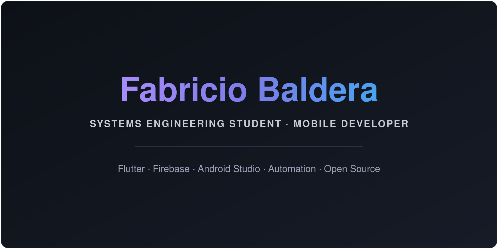

<div align="center">
  
</div>

<p align="center">
  <a href="mailto:fabricio.baldera@upsjb.edu.pe" target="_blank">
    
  </a>&nbsp;
  <a href="https://github.com/FabricioDev0" target="_blank">
    
  </a>&nbsp;
  <a href="https://linkedin.com/in/fabriciodev0" target="_blank">
    
  </a>
</p>


## 👨‍💻 Sobre mí

```javascript
const fabricio = {
    nombre     : "Fabricio Baldera",
    rol        : "Systems Engineering Student · Software Developer",
    ubicacion  : "Lima, Perú 🇵🇪",
    dominio    : "Flutter · Firebase · Mobile Development · Automation",
    enfoque    : ["Clean Code", "Problem Solving", "Software Architecture"],
    conecta    : "Abierto a nuevos proyectos y colaboraciones",
};
```

Estudiante de Ingeniería de Sistemas apasionado por crear herramientas útiles, divertidas y con impacto real. Enfocado en **desarrollo móvil con Flutter** y **tecnologías web modernas**, además de explorar **automatización de flujos de trabajo** con herramientas como n8n. Siempre aprendiendo, construyendo y mejorando como desarrollador.


## 🌍 Idiomas

<div align="center">
<table>
  <tr>
    <td align="center" width="50%">
      
      <br><b>Español</b>
      <br><sub>Nativo</sub>
    </td>
    <td align="center" width="50%">
      
      <br><b>Inglés</b>
      <br><sub>Intermedio</sub>
    </td>
  </tr>
</table>
</div>


## 🛠️ Stack

**Lenguajes**


**Mobile Development**


**Frontend**


**Backend & Datos**


**Automatización & Análisis**


**Herramientas**


## 📊 GitHub Stats

<p align="center">
  
  &nbsp;
  
</p>
<p align="center">
  
</p>


## 📌 Proyecto Destacado

<div align="center">
  <a href="https://github.com/FabricioDev0/MVC_JOAYMI">
    
  </a>
</div>


<div align="center">
  
</div>

<div align="center">
  
</div>
